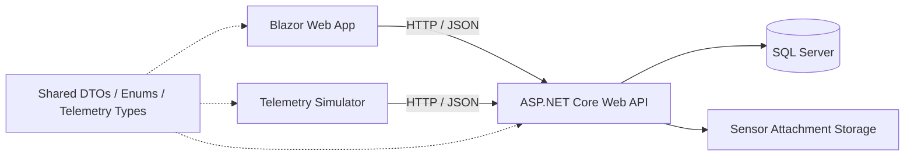

# Smart-X IoT Data Ingestion and Telemetry Gateway

Smart-X is a .NET 10 IoT simulation and management application built to register IoT devices, configure sensors, ingest multi-typed telemetry, detect anomalous readings, manage sensor attachments, and display recent telemetry through a Blazor web interface.

The solution is made up of three runtime applications:

- **API** — ASP.NET Core Web API that manages devices, sensors, deployment nodes, attachments, and telemetry.
- **Web App** — Blazor user interface for device registration, sensor configuration, file management, and telemetry monitoring.
- **Simulator** — Console application that continuously generates simulated IoT telemetry and sends it to the API.
- **Shared** — Shared DTOs, enums, and generic telemetry classes used across the solution.

The solution is configured so that running it from Visual Studio starts the **API, Web App, and Simulator together**.

---

## Table of Contents

- [Features Implemented](#features-implemented)
- [Architecture](#architecture)
- [Technology Stack](#technology-stack)
- [Prerequisites](#prerequisites)
- [Database Set-up](#database-set-up)
- [Running the Project](#running-the-project)
- [Recommended First Run](#recommended-first-run)
- [API Endpoints](#api-endpoints)
- [Telemetry Simulation](#telemetry-simulation)
- [Anomaly Detection](#anomaly-detection)
- [File Attachments](#file-attachments)
- [Advanced C# Concepts Implemented](#advanced-c-concepts-implemented)
- [Troubleshooting](#troubleshooting)
- [Technical References](#technical-references)

---

## Features Implemented

### Device Management

- Register Smart-X IoT devices.
- Store a unique identifier or MAC address for each device.
- Prevent duplicate device identifiers.
- Support device types such as:
  - ESP32
  - Smart Plug
  - Gateway
  - Actuator Controller
  - Smart Meter
  - Other
- Display registered devices together with creation and last-seen timestamps.

### Sensor Management

- Register sensors against an existing device.
- Update existing sensor configurations.
- Assign each sensor to a deployment node/location.
- Support sensor categories including:
  - Environmental
  - Power Consumption
  - Actuator
  - Other
- Support the following telemetry types:
  - `float`
  - `int`
  - `bool`
- Configure numeric sensors with:
  - Unit of measurement
  - Minimum threshold
  - Maximum threshold
  - Maximum allowed change/delta
- Enable or disable sensors.
- Automatically normalise Boolean sensor configuration so numeric thresholds are not applied to Boolean values.

### Deployment Hierarchy

- Deployment locations are represented as hierarchical nodes.
- Recursive traversal builds readable paths such as:

```text
Smart Farm > Greenhouse A > Hydroponics Row 1
```

- A `HashSet` is used while traversing the hierarchy to protect against circular parent relationships.

### Telemetry Processing

- Generic `TelemetryPacket<T>` objects support multiple sensor payload types.
- Separate API routes accept:
  - Float telemetry
  - Integer telemetry
  - Boolean telemetry
- Incoming timestamps are normalised to UTC.
- Per-sensor sequence numbers are generated for telemetry history.
- The current sensor value, status, and last-seen timestamp are updated whenever telemetry is received.
- The parent device's last-seen timestamp is also updated when one of its sensors sends telemetry.

### Telemetry Dashboard

- Displays online and offline sensor totals.
- Displays current sensor status.
- Displays the latest sensor value and last-seen time.
- Displays up to the latest 100 telemetry readings for a selected sensor.
- Clearly distinguishes normal readings from anomalous readings.
- Shows the reason an anomaly was detected.
- The sensor management page refreshes live sensor state and telemetry every **5 seconds** while a sensor is selected.

### Sensor Attachments

Files can be attached directly to a sensor profile.

Supported attachment categories include:

- Configuration File
- Deployment Photo
- Hardware Log
- Other / Miscellaneous

The application supports:

- Upload
- List
- Download
- Delete
- Maximum upload size of **10 MB**

Uploaded physical files are stored beneath the API application's content root in:

```text
uploads/sensors/{sensorId}/
```

File metadata is stored in the database.

---

## Architecture



### Main Components

| Component | Responsibility |
|---|---|
| API | Device, sensor, deployment-node, attachment, and telemetry processing |
| Web App | User-facing Smart-X management and telemetry dashboard |
| Simulator | Generates continuous mock telemetry for active sensors |
| Shared | Shared DTOs, enums, `TelemetryPacket<T>`, and numeric telemetry structures |
| SQL Server | Persistent application and telemetry data |
| File Storage | Stores uploaded sensor configuration files, photos, and logs |

---

## Technology Stack

- **.NET 10**
- **C#**
- **ASP.NET Core Web API**
- **Blazor**
- **Entity Framework Core**
- **SQL Server / SQL Server Express**
- **Bootstrap**
- **System.Net.Http / JSON API communication**

---

## Prerequisites

Before running the project, install:

- [.NET 10 SDK](https://dotnet.microsoft.com/download/dotnet/10.0)
- Visual Studio with ASP.NET and web development support, or another .NET-capable IDE
- [SQL Server 2025 Express](https://www.microsoft.com/en-us/download/details.aspx?id=104781)
- [SQL Server Management Studio (SSMS)](https://learn.microsoft.com/en-us/ssms/install/install)

If using EF Core migrations from the command line and the EF tool is not already installed:

```bash
dotnet tool install --global dotnet-ef
```

Restore the solution dependencies before the first run:

```bash
dotnet restore
```

---

# Database Set-up

## 1. Install Dependencies

If you do not already have SQL Server installed:

### SQL Server 2025 Express

Download and install [SQL Server 2025 Express](https://www.microsoft.com/en-us/download/details.aspx?id=104781).

1. Run the installer.
2. Choose the **Basic** installation type.
3. Leave the default SQL Express instance name, normally:

```text
SQLEXPRESS
```

### SQL Server Management Studio

Download and install [SQL Server Management Studio](https://learn.microsoft.com/en-us/ssms/install/install).

Run the installer and follow the prompts to install the SQL Server database management interface.

For a more detailed installation walkthrough, see [this video guide](https://youtu.be/vbJ_p0Zs3Lk?si=DfLektjjN6NhXhUD).

---

## 2. Create the Database

1. Open **SQL Server Management Studio (SSMS)**.
2. Connect to your local SQL Server Express instance.

The server name will normally be:

```text
localhost\SQLEXPRESS
```

or:

```text
.\SQLEXPRESS
```

3. Select **Windows Authentication**.
4. Click **Connect**.
5. In **Object Explorer**, right-click the **Databases** folder.
6. Select **New Database...**
7. Name the database:

```text
SmartXDb
```

8. Click **OK**.

> If the project already uses a different database name in its connection string, use that name instead so that the database and connection string match.

---

## 3. Configure the Connection String

Open `appsettings.json` in the **API project** and ensure the SQL Server connection string points to your local SQL Express instance.

Example:

```json
{
  "ConnectionStrings": {
    "DefaultConnection": "Server=localhost\\SQLEXPRESS;Database=SmartXDb;Integrated Security=true;TrustServerCertificate=True;"
  }
}
```

If your API configuration uses a different connection-string key, keep the key used by the API's `ApplicationDbContext` registration and only update the server/database values.

---

## 4. Apply Database Migrations

Once the database has been created and the connection string is configured, apply the Entity Framework Core migrations to create the required tables.

### Visual Studio

Open:

**Tools → NuGet Package Manager → Package Manager Console**

If the API project is selected as the default project, run:

```powershell
Update-Database
```

If required, explicitly specify the API project:

```powershell
Update-Database -Project API -StartupProject API
```

### VS Code / .NET CLI

From the solution directory, run:

```bash
dotnet ef database update --project API --startup-project API
```

If your solution places migrations in a different project, change the `--project` value accordingly.

**Database Set-up Complete.**

---

# Running the Project

## Visual Studio — Recommended

The solution is configured with multiple startup projects.

1. Open the Smart-X solution (`.sln`) in Visual Studio.
2. Ensure SQL Server is running.
3. Ensure the database migration has been applied.
4. Build the solution if necessary.
5. Click the green **Start** button or press **F5**.

One Start action launches:

1. **Smart-X API**
2. **Smart-X Web App**
3. **Smart-X Simulator**

The browser will open the web application according to its configured Visual Studio launch profile.

The simulator is configured to communicate with the API at:

```text
http://localhost:5000/
```

Do not change the API port without also updating the simulator and any client-side URLs that depend on it.

### What happens after Start is clicked?

- The API starts and connects to SQL Server.
- The Blazor web application starts.
- The simulator starts in a console window.
- The simulator requests the current list of active sensors from the API.
- For each active sensor, it creates a reading matching that sensor's configured data type.
- Telemetry is submitted to the API.
- The simulator waits **7 seconds** and repeats the process.
- Newly created active sensors are discovered on the next simulation cycle.

To stop the simulator directly from its console, press:

```text
Ctrl + C
```

Stopping the Visual Studio debugging session stops the solution.

---

## Recommended First Run

For a clean first test:

1. Complete the [Database Set-up](#database-set-up).
2. Click **Start** in Visual Studio.
3. Open the **Devices** page.
4. Register a device, for example:
   - Name: `Greenhouse Controller 1`
   - Identifier: `24:6F:28:AA:11:22`
   - Type: `ESP32`
5. Open the **Sensors** page.
6. Register a sensor against the device.
7. Select a deployment location.
8. Select a telemetry type:
   - Float
   - Integer
   - Boolean
9. For a numeric sensor, configure its unit and thresholds.
10. Ensure the sensor is marked **Active**.
11. Save the sensor.
12. Leave the simulator running.
13. Watch new readings arrive.
14. Open the telemetry view to inspect:
   - Latest values
   - Online/offline state
   - Warning state
   - Recent telemetry
   - Anomaly reasons
15. Optionally upload a configuration file, deployment photo, or hardware log to the sensor.

---

# API Endpoints

The simulator expects the API base URL:

```text
http://localhost:5000
```

## Deployment Nodes

| Method | Endpoint | Purpose |
|---|---|---|
| `GET` | `/api/deploymentnodes` | Returns deployment nodes with recursively generated display paths |

---

## Devices

| Method | Endpoint | Purpose |
|---|---|---|
| `GET` | `/api/devices` | Returns all registered devices |
| `GET` | `/api/devices/{id}` | Returns one device by ID |
| `POST` | `/api/devices` | Registers a new IoT device |

### Example Device Request

```json
{
  "name": "Greenhouse Controller 1",
  "uniqueIdentifier": "24:6F:28:AA:11:22",
  "deviceType": 1
}
```

---

## Sensors

| Method | Endpoint | Purpose |
|---|---|---|
| `GET` | `/api/sensors` | Returns all sensors |
| `GET` | `/api/sensors/{id}` | Returns one sensor |
| `POST` | `/api/sensors` | Registers a new sensor |
| `PUT` | `/api/sensors/{id}` | Updates an existing sensor |
| `GET` | `/api/sensors/{id}/telemetry?limit=100` | Returns recent telemetry for a sensor |

The telemetry history `limit` is constrained to a maximum of **100** readings.

---

## Sensor Attachments

| Method | Endpoint | Purpose |
|---|---|---|
| `GET` | `/api/sensors/{sensorId}/attachments` | Lists files attached to a sensor |
| `POST` | `/api/sensors/{sensorId}/attachments` | Uploads a file using `multipart/form-data` |
| `GET` | `/api/sensors/{sensorId}/attachments/{attachmentId}/download` | Downloads an attachment |
| `DELETE` | `/api/sensors/{sensorId}/attachments/{attachmentId}` | Deletes the attachment record and stored file |

The upload endpoint expects:

```text
file
attachmentType
```

Maximum file size:

```text
10 MB
```

---

## Telemetry Ingestion

| Method | Endpoint | Payload Type |
|---|---|---|
| `POST` | `/api/telemetry/float` | `TelemetryPacket<float>` |
| `POST` | `/api/telemetry/integer` | `TelemetryPacket<int>` |
| `POST` | `/api/telemetry/boolean` | `TelemetryPacket<bool>` |

### Example Float Telemetry

```json
{
  "sensorId": 1,
  "value": 24.75,
  "timestampUtc": "2026-09-15T12:00:00Z",
  "unit": "°C"
}
```

### Example Integer Telemetry

```json
{
  "sensorId": 2,
  "value": 850,
  "timestampUtc": "2026-09-15T12:00:00Z",
  "unit": "W"
}
```

### Example Boolean Telemetry

```json
{
  "sensorId": 3,
  "value": true,
  "timestampUtc": "2026-09-15T12:00:00Z",
  "unit": null
}
```

---

# Telemetry Simulation

The `Simulator` project continuously produces mock readings for active sensors.

Its simulation cycle:

1. Calls:

```text
GET /api/sensors
```

2. Filters the list to active sensors with a configured sensor data type.
3. Generates data according to each sensor's type.
4. Builds generic `TelemetryPacket<T>` objects.
5. Posts the packets to the correct telemetry endpoint.
6. Waits **7 seconds** using an asynchronous delay.
7. Repeats until the simulator is stopped.

Because sensors are reloaded during every cycle, newly registered active sensors automatically begin receiving simulated telemetry without restarting the simulator.

### Simulator Data Types

| Sensor Type | Generated Value |
|---|---|
| Float | Random floating-point value |
| Integer | Random integer value |
| Boolean | Random `true` / `false` value |

Numeric simulator values are normally generated within the configured sensor range, but the simulator deliberately produces an out-of-range numeric reading approximately **10% of the time** to make anomaly detection visible during testing.

---

# Anomaly Detection

Numeric telemetry is evaluated against the sensor configuration.

A reading can be marked anomalous when:

- It falls below the configured minimum threshold.
- It exceeds the configured maximum threshold.
- Its change from the previous reading exceeds `MaxAllowedDelta`.

When a numeric anomaly is detected:

```text
SensorStatus.Warning
```

is assigned to the sensor.

Normal numeric telemetry uses:

```text
SensorStatus.Online
```

Boolean telemetry does not use numeric threshold or delta checks.

The API stores the anomaly state and a readable reason with each telemetry-history record so it can be shown in the Blazor interface.

---

# File Attachments

The sensor page uses Blazor file selection and sends the selected file to the API using `multipart/form-data`.

The API:

1. Confirms that the sensor exists.
2. Rejects empty files.
3. Rejects files larger than 10 MB.
4. Removes directory information from the original filename.
5. Generates a unique stored filename.
6. Stores the physical file beneath:

```text
uploads/sensors/{sensorId}/
```

7. Saves attachment metadata to the database.

If saving the database record fails, the API removes the physical file so an orphaned upload is not left behind.

Deleting an attachment removes both:

- The database record.
- The corresponding physical file.

---

# Advanced C# Concepts Implemented

## Generics

The application uses:

```csharp
TelemetryPacket<T>
```

to represent different telemetry payload types without needing a separate packet class for each sensor type.

Generic methods are also used in the simulator to build and send telemetry packets.

---

## Generic Math

Numeric telemetry uses:

```csharp
where T : INumber<T>
```

to support arithmetic across compatible numeric types.

---

## Operator Overloading

`NumericTelemetryReading<T>` provides overloaded operators including:

```text
+
-
>
<
```

The subtraction operator is used during telemetry processing to calculate the difference between the current reading and the previous reading.

---

## Jagged Arrays and Collections

The simulator creates typed telemetry batches using jagged arrays such as:

```csharp
float[][]
int[][]
bool[][]
```

These batches are converted into:

```csharp
List<TelemetryPacket<T>>
```

before transmission to the API.

---

## Recursion

Deployment paths are generated recursively by following each deployment node through its parent hierarchy until the root node is reached.

A `HashSet<long>` tracks visited node IDs so an invalid circular hierarchy cannot recurse indefinitely.

---

## Asynchronous Programming

The application uses `async` / `await` for:

- Database queries
- Database saves
- HTTP requests
- File streaming
- Periodic UI refreshes
- Simulator delays
- Telemetry submission

This allows I/O operations to be performed without unnecessarily blocking the application's execution flow.

---

# Troubleshooting

## Simulator says it cannot connect to the API

The simulator expects:

```text
http://localhost:5000/
```

Confirm that the API is running on port `5000`.

If you intentionally change the API port, update the simulator API address as well.

The sensor attachment download logic also uses the API's localhost address, so keep the client configuration consistent with the API port.

---

## Database connection fails

Check that:

- SQL Server Express is running.
- The server name is correct.
- `SQLEXPRESS` is the correct instance.
- Windows Authentication is available.
- The database name matches the connection string.
- `TrustServerCertificate=True` is present for the local development connection.
- EF Core migrations have been applied.

Example server names:

```text
localhost\SQLEXPRESS
.\SQLEXPRESS
```

---

## Database tables do not exist

Apply migrations again.

Visual Studio:

```powershell
Update-Database
```

.NET CLI:

```bash
dotnet ef database update --project API --startup-project API
```

---

## No telemetry appears

Check that:

- The Simulator project is running.
- The API is running.
- At least one device has been registered.
- At least one sensor has been registered.
- The sensor is marked active.
- The sensor has a valid Float, Integer, or Boolean data type.
- The simulator console shows successful telemetry submissions.

The simulator refreshes its active sensor list every 7 seconds, so a newly created sensor may take one simulation cycle before its first generated reading appears.

---

## A sensor remains Offline

A newly registered sensor starts as Offline until telemetry is received.

Once a valid reading reaches the API, the sensor becomes:

```text
Online
```

or, for anomalous numeric telemetry:

```text
Warning
```

---

## File upload fails

Check that:

- A sensor has been saved or selected first.
- The selected file is not empty.
- The selected file is not larger than 10 MB.
- The API has permission to create and write to the `uploads` directory.

---

# Technical References

The following resources support the main .NET and C# techniques used in the implementation.

1. Refactoring.Guru, 2026. **Composite in C#**. Available at: https://refactoring.guru/design-patterns/composite/csharp/example [Accessed 15 September 2026].

2. Microsoft, 2026. **ASP.NET Core Blazor forms and validation**. Microsoft Learn. Available at: https://learn.microsoft.com/en-us/aspnet/core/blazor/forms/validation?view=aspnetcore-10.0 [Accessed 15 September 2026].

3. Microsoft, 2026. **ASP.NET Core Blazor file uploads**. Microsoft Learn. Available at: https://learn.microsoft.com/en-us/aspnet/core/blazor/file-uploads?view=aspnetcore-10.0 [Accessed 15 September 2026].

4. Microsoft, 2026. **Asynchronous programming with async and await**. Microsoft Learn. Available at: https://learn.microsoft.com/en-us/dotnet/csharp/asynchronous-programming/ [Accessed 15 September 2026].

5. Microsoft, 2026. **Task.Delay Method (System.Threading.Tasks)**. Microsoft Learn. Available at: https://learn.microsoft.com/en-us/dotnet/api/system.threading.tasks.task.delay?view=net-10.0 [Accessed 15 September 2026].

6. Microsoft, 2026. **Generic types and methods**. Microsoft Learn. Available at: https://learn.microsoft.com/en-us/dotnet/csharp/fundamentals/types/generics [Accessed 15 September 2026].

7. Microsoft, 2023. **Generic math**. Microsoft Learn. Available at: https://learn.microsoft.com/en-us/dotnet/standard/generics/math [Accessed 15 September 2026].

8. Microsoft, 2026. **Operator overloading - Define unary, arithmetic, equality, and comparison operators**. Microsoft Learn. Available at: https://learn.microsoft.com/en-us/dotnet/csharp/language-reference/operators/operator-overloading [Accessed 15 September 2026].

9. Microsoft, 2026. **Arrays - C# language reference**. Microsoft Learn. Available at: https://learn.microsoft.com/en-us/dotnet/csharp/language-reference/builtin-types/arrays [Accessed 15 September 2026].

10. Microsoft, 2023. **One-to-many relationships - EF Core**. Microsoft Learn. Available at: https://learn.microsoft.com/en-us/ef/core/modeling/relationships/one-to-many [Accessed 15 September 2026].

---

## Assessment Context

This project forms the Smart-X Data Ingestion and Validation Gateway implementation for PROG7312 Programming 3B.

The project is designed to demonstrate a working API/frontend architecture together with advanced C# concepts, IoT telemetry simulation, sensor configuration, telemetry history, anomaly detection, file attachment handling, and recursive deployment hierarchy processing.
